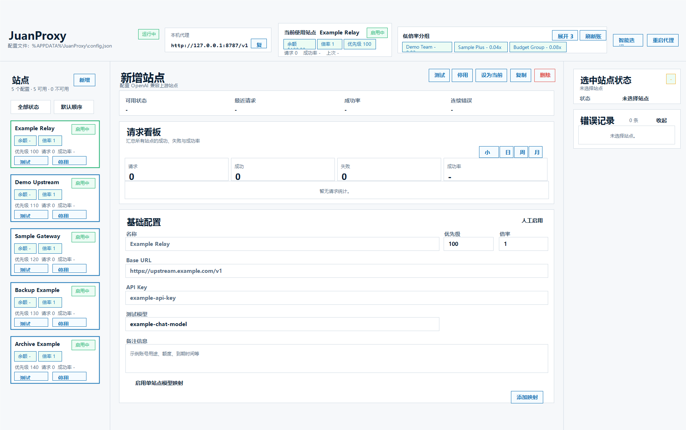

# JuanProxy

JuanProxy 是一个用于管理多组 chatgpt 中转站的桌面应用，通过一个本机代理地址统一转发请求，不需要频繁切换配置，codex友好。

自动实时的低倍率检测，哪家便宜用哪家。

可选自动按照倍率或者自定义优先级使用，报错自动切换，自动监控恢复可用。

兼容主流开源中转站模板，支持应用中查看账户余额、倍率、分组等信息，可以直接在应用中切换分组。

把中转站都导进来，低价模式卷起来。

## 界面预览



## 目录

- [界面预览](#界面预览)
- [功能特性](#功能特性)
- [运行环境](#运行环境)
- [安装与启动](#安装与启动)
- [快速使用](#快速使用)
- [站点配置](#站点配置)
- [代理设置](#代理设置)
- [模型映射](#模型映射)
- [配置导入导出](#配置导入导出)
- [故障切换](#故障切换)
- [限流与自动恢复](#限流与自动恢复)
- [远端账号同步](#远端账号同步)
- [模型与能力探测](#模型与能力探测)
- [本地数据与隐私](#本地数据与隐私)
- [开发](#开发)
- [贡献](#贡献)
- [许可证](#许可证)

## 功能特性

- 管理多组 OpenAI 兼容 API 上游站点。
- 为每个站点保存名称、备注、Base URL、API Key、优先级、倍率、测试模型、模型映射、同步配置、限流配置和自动恢复配置。
- 启动本机代理地址，默认监听 `http://127.0.0.1:8787/v1`。
- 转发 OpenAI 兼容请求，并自动把客户端传入的 `Authorization` 替换为当前上游站点的 API Key。
- 支持常见 `/v1` 路径转发，包括 Chat Completions、Responses 等 OpenAI 兼容接口。
- 提供本机健康检查接口 `/__proxy/health`。
- 支持按优先级或倍率智能选择站点。
- 支持同优先级站点轮询或随机选择。
- 支持手动设为当前站点、启用、停用、复制、删除和测试站点。
- 支持请求级故障切换。可重放请求在一个上游失败后，可自动尝试其他可用站点。
- 支持失败阈值。连续失败达到阈值后可自动停用故障站点，并切换到其他可用站点。
- 支持错误停用后的自动自检恢复。
- 支持每个站点独立限流，可按分钟或小时窗口暂停站点。
- 提供请求看板，展示请求数、成功数、错误数、成功率，以及小时、日、周、月统计。
- 支持按可用状态筛选站点，按请求数、成功率、余额或倍率排序站点。
- 支持全局模型映射和单站点模型映射。单站点映射优先于全局映射。
- 支持批量粘贴模型映射规则，例如 `request-model=upstream-model` 或 `chat-model -> relay-chat-model`。
- 支持配置导入导出，可导出全部站点、当前站点或手动选择部分站点，并可选择是否包含全局设置。
- 支持通过 `/v1/models` 探测站点模型列表和能力特征。
- 支持远端账号同步，可读取受支持中转面板的账号名、余额、API 端点、Key 名称、分组、倍率和可用分组。
- 支持受支持中转面板的远端分组切换。
- 支持账号信息同步默认间隔、自定义站点同步间隔、分组倍率刷新间隔和智能同步调度。
- 支持按远端面板网站维护分组倍率名单，刷新一次即可同步到同网站下的相关站点配置。
- 支持在请求转发过程中预热可能需要同步的分组倍率网站。
- 支持运行时错误日志，并对 API Key、Token、密码、Cookie 等敏感信息做脱敏。

## 运行环境

- Node.js 22 或更新版本
- npm
- Electron 支持的 Windows、macOS 或 Linux 桌面环境

## 安装与启动

克隆仓库并安装依赖：

```powershell
git clone <repo-url>
cd JuanProxy
npm install
```

启动桌面应用：

```powershell
npm start
```

运行测试：

```powershell
npm test
```

## 快速使用

1. 运行 `npm start` 启动 JuanProxy。
2. 点击 **新增** 创建一个上游站点。
3. 填写站点信息：
   - 站点名称
   - 上游 Base URL，例如 `https://upstream.example.com/v1`
   - 上游 API Key
   - 可选的优先级、倍率、测试模型和备注
4. 点击 **测试** 验证站点是否可用。
5. 点击 **保存站点**。
6. 在 OpenAI SDK 或其他兼容客户端中，把 `baseURL` 指向应用顶部显示的本机代理地址，通常是：

```text
http://127.0.0.1:8787/v1
```

JavaScript 示例：

```js
import OpenAI from "openai";

const client = new OpenAI({
  apiKey: "example-local-key",
  baseURL: "http://127.0.0.1:8787/v1"
});
```

Python 示例：

```python
from openai import OpenAI

client = OpenAI(
    api_key="example-local-key",
    base_url="http://127.0.0.1:8787/v1",
)
```

客户端传入的 API Key 不会原样转发。JuanProxy 会在转发请求时替换为当前上游站点配置的 API Key。

## 站点配置

每个站点支持以下主要字段：

| 字段 | 说明 |
| --- | --- |
| 名称 | 站点在界面中的显示名称 |
| Base URL | 上游 API 地址，通常以 `/v1` 结尾 |
| API Key | 转发请求时使用的上游密钥 |
| 测试模型 | 手动测试站点时使用的模型，默认 `example-chat-model` |
| 优先级 | 数字越小越优先，适用于优先级选择模式 |
| 倍率 | 数字越小越优先，适用于倍率选择模式 |
| 备注 | 本地备注，可记录用途、额度、到期时间等 |
| 模型映射 | 该站点专属的模型改写规则 |
| 远端同步 | 远端面板登录与账号同步配置 |
| 限流 | 该站点的本地请求窗口限制 |
| 自动恢复 | 故障停用后的自动自检恢复配置 |

JuanProxy 会阻止站点 Base URL 指向本机代理端口，避免把代理请求转回自己导致循环转发。

## 代理设置

全局代理设置包括：

- 代理端口，默认 `8787`
- 上游请求超时时间，默认 `120` 秒
- 失败阈值，默认 `3`
- 站点选择模式：
  - 按优先级
  - 按倍率
- 同优先级选择策略：
  - 轮询
  - 随机
- 是否启用智能选择
- 全局模型映射

关闭智能选择后，JuanProxy 会优先使用当前手动选中的站点。当前站点不可用或处于限流暂停状态时，请求可能无法继续转发。

## 模型映射

模型映射会在请求转发前改写 JSON 请求体顶层的 `model` 字段。

全局映射对所有站点生效：

```text
request-model=upstream-model
chat-model -> relay-chat-model
```

单站点映射优先于全局映射：

```text
client-model=provider-model
chat-model -> relay-chat-model
```

以下请求不会被模型映射改写：

- 非 JSON 请求
- 请求体过大的流式请求
- 未启用模型映射的请求
- 没有命中映射规则的模型

## 配置导入导出

左侧 **配置导入导出** 面板用于备份或迁移本机配置。

导出时可以选择：

- 全部站点
- 当前选中站点
- 手动勾选部分站点
- 是否包含代理设置、账号同步设置和全局模型映射

导入时先选择 JSON 文件预览内容，再勾选要导入的站点，也可以选择是否导入全局设置。

导入采用合并策略：

- 会为导入站点生成新的本地 ID。
- 不会删除或覆盖现有站点。
- 不会导入请求统计、错误记录、运行状态和远端同步缓存。
- 如果导入全局代理端口并导致端口变化，应用会重启本机代理。

导出的 JSON 可能包含 API Key、远端面板地址、用户名和密码。请把导出文件当作敏感文件保存，不要提交到公开仓库或 Issue。

## 故障切换

正常转发过程中，JuanProxy 会记录每个站点的请求结果：

- 成功请求会重置连续错误计数。
- 上游错误会写入站点错误记录。
- 可重放请求失败时，会尝试切换到其他可用站点。
- 不可重放或请求体过大的请求不会被重复发送。
- 过大的上游错误响应会直接流式返回给客户端，不会强行完整缓存。
- 客户端断开连接时，会取消正在进行的上游请求。
- 连续站点健康错误达到失败阈值后，站点会被自动停用。

## 限流与自动恢复

每个站点都可以启用本地限流：

- 按分钟或小时窗口统计请求数。
- 达到限制后，该站点会暂停到当前窗口结束。
- 智能选择会跳过处于限流暂停状态的站点。

每个站点也可以启用自动恢复：

- 只对故障停用的站点生效。
- 不会重新启用人工停用的站点。
- 按配置间隔执行站点测试。
- 测试通过后可重新启用站点。
- 界面会展示上次恢复结果和下次检查时间。

## 远端账号同步

远端同步用于从受支持的中转面板拉取账号和 Key 信息。

支持的提供方类型：

- `auto`：自动识别面板类型
- `modern-v1`：`/api/v1` 风格面板
- `new-api`：New API `/api` 风格面板

同步成功后可更新：

- 账号名称
- 余额
- API 端点
- 远端 Key 名称
- 当前分组
- 分组倍率
- 可切换分组列表
- 最近同步时间、状态和错误信息

对于支持的面板，JuanProxy 可以在界面中切换远端 Key 或 Token 的分组，并在切换后刷新本地元数据。

分组倍率刷新会按远端面板网站去重维护名单：同一个面板地址下的多个站点只请求一次远端分组接口，刷新到的分组列表会自动同步到这些相关站点中。只有已经配置远端同步并填写后台地址、账号和密码的站点会进入分组倍率网站名单；仅本地存在但远端接口没有返回的分组不会加入可选远端分组列表。

同步设置中可以分别配置：

- 账号信息默认同步间隔：用于单站点继承全局时的账号信息同步默认值。
- 分组倍率刷新间隔：用于后台定时刷新和顶部 **刷新分组** 的网站级分组倍率同步。
- 智能同步调度：请求转发时会预热可能即将使用的网站级分组倍率数据。

## 模型与能力探测

点击 **刷新模型** 后，JuanProxy 会请求上游 `/v1/models`，保存模型列表并根据模型 ID 和元数据推断能力特征。

能力探测是启发式结果，适合快速对比站点能力。最终可用能力仍以上游实际接口行为为准。

## 本地数据与隐私

JuanProxy 把配置保存在 Electron 的用户数据目录中，应用顶部会显示配置文件路径。

在 Windows 上默认路径为 `%APPDATA%\JuanProxy\config.json`。应用不会自动回退到旧项目名的数据目录；如需迁移旧配置，请先手动复制到当前目录，或使用界面里的配置导入功能。

常见本地文件：

| 文件 | 说明 |
| --- | --- |
| `config.json` | 站点、代理、同步、限流等配置 |
| `window-state.json` | 窗口尺寸 |
| `logs/runtime-errors.jsonl` | 运行时错误日志，包含敏感字段脱敏 |

API Key 和远端同步账号密码会保存在本机 `config.json` 中。JuanProxy 当前不会加密这个文件。

请不要把以下内容提交到仓库、Issue 或 Pull Request：

- 真实 `config.json`
- 运行时日志
- 包含 API Key、远端面板地址、用户名、余额或账号元数据的截图
- API Key
- 密码
- Cookie
- Bearer Token
- 私有中转面板地址

示例、测试和文档应使用 `example.com` 这类保留域名。

如果真实凭据曾经被提交或上传，请立即轮换或吊销。仅在后续提交中删除并不能保证凭据安全。

安全问题报告方式见 `SECURITY.md`。

## 开发

安装依赖：

```powershell
npm install
```

启动应用：

```powershell
npm start
```

运行测试：

```powershell
npm test
```

项目使用 Node.js 内置测试运行器。

## 项目结构

```text
assets/                 应用图标
src/app-identity.js     应用名称、App ID 和用户数据目录选择
src/main.js             Electron 主进程和 IPC 处理
src/preload.js          Renderer preload bridge
src/proxy/              代理、配置、切换、同步、测试等核心逻辑
src/renderer/           桌面端界面
tests/                  Node.js 测试用例
```

## 贡献

提交 Pull Request 前请确认：

- 不提交真实凭据或私有域名。
- 示例、测试和文档使用 `example.com` 域名。
- 已运行 `npm test`。
- 用户可见行为变化已更新 README 或 CHANGELOG。

更多说明见 `CONTRIBUTING.md`。

## 许可证

MIT. See `LICENSE`.
