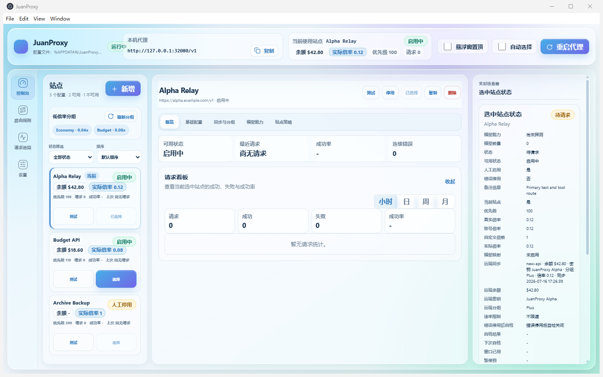

# JuanProxy

JuanProxy 是一个用于管理多组 chatgpt 中转站的桌面应用，通过一个本机代理地址统一转发请求，不需要频繁切换配置，codex友好。

自动实时的实际倍率检测，哪家便宜用哪家。

可选自动按照实际倍率或者自定义优先级使用，报错自动切换，自动监控恢复可用。

兼容主流开源中转站模板，支持应用中查看账户余额、倍率、分组等信息，可以直接在应用中切换分组。

把中转站都导进来，低价模式卷起来。

## 界面预览



## 目录

- [界面预览](#界面预览)
- [功能特性](#功能特性)
- [运行环境](#运行环境)
- [安装与启动](#安装与启动)
- [快速使用](#快速使用)
- [站点配置](#站点配置)
- [代理设置](#代理设置)
- [模型映射](#模型映射)
- [配置导入导出](#配置导入导出)
- [故障切换](#故障切换)
- [限流与自动恢复](#限流与自动恢复)
- [Codex 任务自动恢复](#codex-任务自动恢复)
- [远端账号同步](#远端账号同步)
- [飞书监控](#飞书监控)
- [模型与能力探测](#模型与能力探测)
- [本地数据与隐私](#本地数据与隐私)
- [开发](#开发)
- [贡献](#贡献)
- [许可证](#许可证)

## 功能特性

- 管理多组 OpenAI 兼容 API 上游站点。
- 为每个站点保存名称、备注、Base URL、API Key、优先级、真实倍率、可选自定义倍数、模型映射、同步配置、限流配置和自动恢复配置。
- 启动本机代理地址，默认监听 `http://127.0.0.1:8787/v1`；可在代理设置中允许可信局域网设备访问。
- 转发 OpenAI 兼容请求，并自动把客户端传入的 `Authorization` 替换为当前上游站点的 API Key。
- 支持常见 `/v1` 路径转发，包括 Chat Completions、Responses 等 OpenAI 兼容接口。
- 提供本机健康检查接口 `/__proxy/health`。
- 支持按优先级或实际倍率智能选择站点。
- 支持同优先级站点轮询或随机选择。
- 支持手动设为当前站点、启用、停用、复制、删除和测试站点。
- 支持请求级故障切换。可重放请求在一个上游失败后，可自动尝试其他可用站点。
- 支持失败阈值。连续失败达到阈值后可自动停用故障站点，并切换到其他可用站点。
- 支持错误停用后的自动自检恢复。
- 支持可选的 Codex 任务自动恢复，在站点恢复后继续因 JuanProxy 无可用站点而停止的任务。
- 支持每个站点独立限流，可按分钟或小时窗口暂停站点。
- 提供请求看板，展示请求数、成功数、错误数、成功率，以及小时、日、周、月统计。
- 提供请求路由追踪，展示最近请求的站点尝试链、请求级切换、最终状态和全局选择是否保持。
- 支持按可用状态筛选站点，按请求数、成功率、余额或实际倍率排序站点。
- 支持全局模型映射和单站点模型映射。单站点映射优先于全局映射。
- 支持批量粘贴模型映射规则，例如 `request-model=upstream-model` 或 `chat-model -> relay-chat-model`。
- 支持配置导入导出，可导出全部站点、当前站点或手动选择部分站点，并可选择是否包含全局设置。
- 支持通过 `/v1/models` 探测站点模型列表和能力特征。
- 支持远端账号同步，可读取受支持中转面板的账号名、余额、API 端点、Key 名称、分组、倍率和可用分组。
- 同一面板下相同账号自动归并为共享账号，统一维护登录配置并持久复用同一登录会话。
- 支持从应用主动退出已保存的远端登录设备；创建远端密钥后会立即导入为新站点。
- 支持受支持中转面板的远端分组切换。
- 支持账号信息同步默认间隔、自定义站点同步间隔、分组倍率刷新间隔和智能同步调度。
- 支持按远端面板网站维护分组倍率名单，刷新一次即可同步到同网站下的相关站点配置。
- 支持在请求转发过程中预热可能需要同步的分组倍率网站。
- 支持独立飞书 Watchdog，按开关通知倍率切换、余额不足、长时间无可用站点、程序异常、Codex 普通回答完成和目标完成/暂停。
- 支持运行时错误和请求路由 JSONL 日志，并对 API Key、Token、密码、Cookie 等敏感信息做脱敏。
- 桌面端采用冰川极光液态玻璃控制台，提供控制台、路由规则、请求追踪和设置四个任务域。
- 控制台采用站点列表、站点工作区、实时检查器三栏布局；窗口较窄时检查器自动收为右侧抽屉。
- 界面采用紧凑的 15px 桌面基准字号；宽屏增加表单列数和可见信息，窄窗口则把导航、站点工作区和表单重排为可滚动单列布局。
- 低倍率分组可在原位置查看站点、余额和实际倍率，并直接切换或显式筛选关联站点，不再自动跳页。
- 站点配置按概览、基础配置、同步与分组、模型能力、站点策略拆分，切换站点前会保护未保存内容。

## 运行环境

- Node.js 22 或更新版本
- npm
- Electron 支持的 Windows、macOS 或 Linux 桌面环境

## 安装与启动

克隆仓库并安装依赖：

```powershell
git clone <repo-url>
cd JuanProxy
npm install
```

启动桌面应用：

```powershell
npm start
```

运行测试：

```powershell
npm test
```

## 快速使用

1. 运行 `npm start` 启动 JuanProxy。
2. 进入 **站点** 视图，点击 **新增** 创建一个上游站点。
3. 填写站点信息：
   - 站点名称
   - 上游 Base URL，例如 `https://upstream.example.com/v1`
   - 上游 API Key
   - 可选的优先级、真实倍率、自定义倍数和备注
4. 点击 **测试** 验证站点是否可用。
5. 点击 **保存站点**。
6. 在 **总览** 视图确认代理状态、当前站点和请求看板。
7. 在 OpenAI SDK 或其他兼容客户端中，把 `baseURL` 指向应用顶部显示的本机代理地址，通常是：

```text
http://127.0.0.1:8787/v1
```

JavaScript 示例：

```js
import OpenAI from "openai";

const client = new OpenAI({
  apiKey: "在 JuanProxy 中生成并复制的本地 API 密钥",
  baseURL: "http://127.0.0.1:8787/v1"
});
```

Python 示例：

```python
from openai import OpenAI

client = OpenAI(
    api_key="在 JuanProxy 中生成并复制的本地 API 密钥",
    base_url="http://127.0.0.1:8787/v1",
)
```

客户端必须使用 **路由策略 → 代理与自动选择** 中生成的本地 API 密钥。JuanProxy 只保存其 SHA-256 摘要，明文仅在首次生成或重新生成后显示一次；重新生成会立即废止旧密钥。通过验证后，JuanProxy 会删除客户端凭据，并在转发请求时替换为当前上游站点配置的 API Key。

## 站点配置

每个站点支持以下主要字段：

| 字段 | 说明 |
| --- | --- |
| 名称 | 站点在界面中的显示名称 |
| Base URL | 上游 API 地址，通常以 `/v1` 结尾 |
| API Key | 转发请求时使用的上游密钥 |
| 测试模型 | 在“路由策略”的代理设置中全局配置，供所有站点的手动测试和自动自检使用，默认 `example-chat-model` |
| 优先级 | 数字越小越优先，适用于优先级选择模式 |
| 真实倍率 | 锁定时直接作为实际倍率；数字必须大于或等于 `0` |
| 自定义倍数 | 未锁定真实倍率时，可选的账号倍率乘数；启用后必须大于 `0` |
| 锁定真实倍率 | 启用后直接使用填写的真实倍率，远端同步不会覆盖该值 |
| 备注 | 本地备注，可记录用途、额度、到期时间等 |
| 模型映射 | 该站点专属的模型改写规则 |
| 远端同步 | 远端面板登录与账号同步配置 |
| 限流 | 该站点的本地请求窗口限制 |
| 自动恢复 | 故障停用后的自动自检恢复配置 |

JuanProxy 会阻止站点 Base URL 指向本机代理端口，避免把代理请求转回自己导致循环转发。

## 代理设置

全局代理设置包括：

- 代理端口，默认 `8787`
- 局域网访问，默认关闭；开启后监听全部 IPv4 网卡，并在顶部显示可供同一局域网设备使用的内网地址
- 上游请求超时时间，默认 `120` 秒
- 失败阈值，默认 `3`
- 站点选择模式：
  - 按优先级
  - 按实际倍率
- 同优先级选择策略：
  - 轮询
  - 随机
- 是否启用智能选择
- 全局模型映射

关闭智能选择后，JuanProxy 会优先使用当前手动选中的站点。当前站点不可用或处于限流暂停状态时，请求可能无法继续转发。

实际倍率按锁定状态计算：

```text
锁定真实倍率：实际倍率 = 真实倍率
未锁定真实倍率：实际倍率 = 账号倍率 × 自定义倍数
```

账号倍率取远端同步得到的当前分组倍率；尚未同步时回退到站点倍率。自定义倍数未启用时按 `1` 计算。锁定真实倍率后，自定义倍数暂不参与计算。站点的实际倍率排序、自动选择、优先级同档比较和最高自动使用倍率限制都使用该结果。

## 模型映射

模型映射会在请求转发前改写 JSON 请求体顶层的 `model` 字段。

全局映射对所有站点生效：

```text
request-model=upstream-model
chat-model -> relay-chat-model
```

单站点映射优先于全局映射：

```text
client-model=provider-model
chat-model -> relay-chat-model
```

以下请求不会被模型映射改写：

- 非 JSON 请求
- 请求体过大的流式请求
- 未启用模型映射的请求
- 没有命中映射规则的模型

## 配置导入导出

左侧 **配置导入导出** 面板用于备份或迁移本机配置。

导出时可以选择：

- 全部站点
- 当前选中站点
- 手动勾选部分站点
- 是否包含代理设置、账号同步设置和全局模型映射

导入时先选择 JSON 文件预览内容，再勾选要导入的站点，也可以选择是否导入全局设置。

导入采用合并策略：

- 会为导入站点生成新的本地 ID。
- 不会删除或覆盖现有站点。
- 不会导入请求统计、错误记录、运行状态和远端同步缓存。
- 相同面板源站和用户名的导入站点会立即关联到同一个共享账号。
- 如果导入全局代理端口并导致端口变化，应用会重启本机代理。

导出的 JSON 可能包含 API Key、远端面板地址、用户名和密码。请把导出文件当作敏感文件保存，不要提交到公开仓库或 Issue。

## 故障切换

正常转发过程中，JuanProxy 会记录每个站点的请求结果：

- 成功请求会重置连续错误计数。
- 上游错误会写入站点错误记录。
- 可重放请求失败时，会尝试切换到其他可用站点。
- 不可重放或请求体过大的请求不会被重复发送。
- 过大的上游错误响应会直接流式返回给客户端，不会强行完整缓存。
- 客户端断开连接时，会取消正在进行的上游请求。
- 连续站点健康错误达到失败阈值后，站点会被自动停用。

对于 `sensitive_words_detected` 这类请求内容被单个上游策略拒绝、但不代表站点失效的错误，JuanProxy 会在本次请求内尝试其他匹配站点；这类请求级切换不会改写全局当前选择，也不会把原站点标记为健康故障。

右侧 **请求路由** 面板会显示最近请求的路由追踪，包括请求方法、路径、query key、模型映射、每次尝试的站点、HTTP 状态、错误分类、是否触发单请求切换，以及全局选择是否保持不变。追踪数据不会记录请求体、请求 Header、API Key、Cookie、Bearer Token、query value 或上游错误响应正文。

## 限流与自动恢复

每个站点都可以启用本地限流：

- 按分钟或小时窗口统计请求数。
- 达到限制后，该站点会暂停到当前窗口结束。
- 智能选择会跳过处于限流暂停状态的站点。

每个站点也可以启用自动恢复：

- 只对故障停用的站点生效。
- 不会重新启用人工停用的站点。
- 按配置间隔执行站点测试。
- 测试通过后可重新启用站点。
- 界面会展示上次恢复结果和下次检查时间。

## Codex 任务自动恢复

在 **路由策略 > 代理与自动选择** 中开启 **Codex 任务自动恢复** 后，JuanProxy 会同时启用两层恢复：

- 对尚未返回响应、请求体可重放的请求，在没有可用站点时进行有界等待；站点恢复后重新选择站点并继续请求。
- 对已经因 `juanproxy_no_available_site`、模型容量不足或 Responses 流未收到 `response.completed` 而停止的 Codex 任务，记录线程和失败 turn 的恢复元数据；存在可用站点后通过 Windows Codex App 自带的 App Server 启动一个新的 continuation turn。

该功能默认关闭。关闭开关会停止等待、取消正在执行的自动续跑，并清空待恢复队列。JuanProxy 只识别稳定错误码和明确的可重试错误文本对应的 Codex 生命周期事件，不读取对话正文，也不会修改 Codex 的目标数据库或 rollout 文件。用户暂停、阻塞或已完成的目标不会自动继续；线程已有更新 turn 时，旧失败也会被丢弃。

已开始返回的流式响应无法从断点原位续传，因此只能在原任务结束并被准确识别后，以新 turn 继续。自动恢复最多尝试三次，队列文件只保存线程 ID、失败 turn ID、rollout 路径、时间、尝试次数和脱敏错误。

## 远端账号同步

远端同步用于从受支持的中转面板拉取账号和 Key 信息。

支持的提供方类型：

- `auto`：自动识别面板类型
- `modern-v1`：`/api/v1` 风格面板
- `new-api`：New API `/api` 风格面板

JuanProxy 会按规范化后的面板源站和用户名识别共享账号。同一账号关联的所有站点共用后台地址、用户名、密码和提供方类型；在任一关联站点修改这些字段并保存后，其他关联站点会同步更新，不需要逐个修改。旧配置和新导入的配置也会自动执行相同归并。

同步、创建密钥和切换分组时会优先复用已保存的 Bearer Token 或 Cookie 会话。会话通过账号资料接口验证；只有明确收到 `401/403` 时才会重新登录一次并保存新会话，网络错误、限流或其他业务错误不会额外创建设备。同一账号的远端操作会串行执行，避免并发重复登录。

远端 Key 列表会分页读取，并兼容部分 New API 面板返回完整 Key 时省略 `sk-` 的格式。登录已成功但后续资料、Key 或分组请求失败时，JuanProxy 仍会保存刚建立的账号会话，后续重试不会再次创建设备。

当面板启用 Turnstile 或 API 接口被 Cloudflare、阿里云 WAF/ESA 等网页挑战保护时，JuanProxy 会打开独立验证窗口。自动验证未在短时间内完成时窗口才会显示；完成验证后原同步会自动继续。浏览器验证 Cookie 会与账号 Cookie 合并，且只允许打开原面板同源的挑战 URL。

常见外部恢复方式：

- `AUTH_SESSION_LIMIT` / HTTP 409：在已登录的远端控制台撤销其他会话或设备；没有可用会话时重置密码，再回到 JuanProxy 同步。
- HTTP 429：等待面板限流窗口恢复，不要连续点击同步或刷新分组。
- Cloudflare/Turnstile 验证：在首次同步出现的验证窗口中完成验证；关闭窗口会保留已建立会话并记录失败，之后可再次同步。

点击 **退出账号** 会使用当前缓存会话调用对应面板的登出接口，不会为了登出再次登录。会话已过期或面板不支持登出接口时会清除本地会话；普通网络失败会保留本地会话以便重试。退出后下一次同步会重新登录。

点击 **创建密钥** 后，创建成功的 Key 会立即作为新站点导入，原站点 API Key 保持不变。新站点会复制源站点的 Base URL、优先级、自定义倍率和倍率锁定、模型映射、能力信息、共享账号及同步配置、限流、自动恢复、启用状态和备注，并使用创建结果中的新 Key 元数据。

同步成功后可更新：

- 账号名称
- 余额
- API 端点
- 远端 Key 名称
- 当前分组
- 分组倍率
- 可切换分组列表
- 最近同步时间、状态和错误信息

对于支持的面板，JuanProxy 可以在界面中切换远端 Key 或 Token 的分组，并在切换后刷新本地元数据。

分组倍率刷新会按远端面板网站去重维护名单：同一个面板地址下的多个站点只请求一次远端分组接口，刷新到的分组列表会自动同步到这些相关站点中。只有已经配置远端同步并填写后台地址、账号和密码的站点会进入分组倍率网站名单；仅本地存在但远端接口没有返回的分组不会加入可选远端分组列表。

同步设置中可以分别配置：

- 账号信息默认同步间隔：用于单站点继承全局时的账号信息同步默认值。
- 分组倍率刷新间隔：用于后台定时刷新和顶部 **刷新分组** 的网站级分组倍率同步。
- 智能同步调度：请求转发时会预热可能即将使用的网站级分组倍率数据。

## 飞书监控

JuanProxy 使用飞书群自定义机器人 Webhook 发送通知。Watchdog 是独立 Node.js 进程，因此 Electron 主程序或本地代理退出后仍可告警。

1. 在飞书群的 **设置 → 群机器人 → 添加机器人 → 自定义机器人** 中复制 Webhook。
2. 在 JuanProxy 的 **路由策略 → 飞书监控** 中填写 Webhook，发送测试消息后启用监控。
3. 选择需要的六类通知；在任一关联站点的 **站点策略 → 飞书余额提醒** 中设置当前账号的独立余额阈值，或关闭该账号的余额提醒。同一账号关联的全部站点共用此配置。
4. 点击 **安装并启动后台任务**，JuanProxy 会注册并立即启动当前用户的 Windows 任务计划。

命令行也可以执行同一操作：

```powershell
powershell -NoProfile -ExecutionPolicy Bypass -File .\scripts\install-feishu-watchdog.ps1
```

界面的 **停止并移除后台任务** 可完成清理；对应命令为：

```powershell
powershell -NoProfile -ExecutionPolicy Bypass -File .\scripts\uninstall-feishu-watchdog.ps1
```

Watchdog 每 30 秒检查一次。程序异常在连续 3 次无法访问 `/__proxy/health` 后通知；无可用站点默认持续 5 分钟后通知。持续类异常每 30 分钟提醒一次，恢复后通知一次。倍率通知以当前活动路由的实际倍率为准，首次检查只建立基线，实际倍率发生变化时通知。告警卡片标题统一采用“通知类型：具体内容”，例如 `回答完成：会话名`、`余额不足：站点名`、`倍率切换：1x → 0.5x`；持续和恢复状态附在标题末尾。

六类通知可以分别开启或关闭；关闭时会清理该类活动状态。余额阈值直接使用远端展示的数值单位，不进行币种换算，且只在最近一次账号同步成功并取得有效余额时判断。`Codex 普通对话回答完成` 和 `Codex 目标完成或暂停` 默认关闭：目标处于活动、暂停或阻塞状态时不发送单轮回答通知，仅在目标暂停或完成时发送目标通知；目标完成后的普通对话恢复单轮回答通知。通知按会话事件去重，不发送目标内容或回答正文。

飞书 Webhook 和站点提醒规则保存在本机 `config.json`，不会进入界面导出的配置文件。

## 模型与能力探测

点击 **刷新模型** 后，JuanProxy 会请求上游 `/v1/models`，保存模型列表并根据模型 ID 和元数据推断能力特征。

能力探测是启发式结果，适合快速对比站点能力。最终可用能力仍以上游实际接口行为为准。

## 本地数据与隐私

JuanProxy 把配置保存在 Electron 的用户数据目录中，应用顶部会显示配置文件路径。

在 Windows 上默认路径为 `%APPDATA%\JuanProxy\config.json`。应用不会自动回退到旧项目名的数据目录；如需迁移旧配置，请先手动复制到当前目录，或使用界面里的配置导入功能。

常见本地文件：

| 文件 | 说明 |
| --- | --- |
| `config.json` | 站点、代理、同步、限流等配置 |
| `window-state.json` | 窗口尺寸 |
| `codex-recovery-queue.json` | Codex 待恢复线程元数据，不含对话正文 |
| `feishu-watchdog-state.json` | 飞书告警去重、持续提醒和恢复状态，不含站点凭据 |
| `logs/runtime-errors.jsonl` | 运行时错误与请求路由日志，包含敏感字段脱敏 |

站点 API Key、远端同步账号密码以及复用登录所需的 Bearer Token/Cookie 会保存在本机明文 `config.json` 中。JuanProxy 当前不会加密这些上游凭据，因此必须把 `config.json` 视为敏感凭证文件。本地 API 密钥只保存 SHA-256 摘要；发送给 Renderer 的常规状态和界面导出的配置不包含该摘要或运行会话 Token/Cookie。

请不要把以下内容提交到仓库、Issue 或 Pull Request：

- 真实 `config.json`
- 运行时日志
- 包含 API Key、远端面板地址、用户名、余额或账号元数据的截图
- API Key
- 密码
- Cookie
- Bearer Token
- 私有中转面板地址

示例、测试和文档应使用 `example.com` 这类保留域名。

如果真实凭据曾经被提交或上传，请立即轮换或吊销。仅在后续提交中删除并不能保证凭据安全。

安全问题报告方式见 `SECURITY.md`。

## 开发

安装依赖：

```powershell
npm install
```

启动应用：

```powershell
npm start
```

运行测试：

```powershell
npm test
```

项目使用 Node.js 内置测试运行器。

## 项目结构

```text
assets/                 应用图标
src/app-identity.js     应用名称、App ID 和用户数据目录选择
src/main.js             Electron 主进程和 IPC 处理
src/preload.js          Renderer preload bridge
src/proxy/              代理、配置、切换、同步、测试等核心逻辑
src/monitoring/         独立飞书 Watchdog 告警逻辑
src/renderer/           桌面端界面
tests/                  Node.js 测试用例
```

## 贡献

提交 Pull Request 前请确认：

- 不提交真实凭据或私有域名。
- 示例、测试和文档使用 `example.com` 域名。
- 已运行 `npm test`。
- 用户可见行为变化已更新 README 或 CHANGELOG。

更多说明见 `CONTRIBUTING.md`。

## 许可证

MIT. See `LICENSE`.
