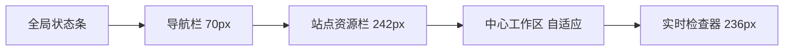

# JuanProxy 三栏液态玻璃改版设计

**日期：** 2026-07-16
**状态：** 已确认
**确认方向：** 三栏一体式管理器 + 冰川极光液态玻璃

## 1. 改版目标

把 JuanProxy 从“多个页面之间来回跳转的配置工具”改成“可持续观察、直接操作、不中断上下文的代理控制台”。

核心验收目标：

1. 点击低倍率分组后可在原位置查看站点、余额和倍率，并直接切换，不自动跳页。
2. 日常站点管理同时显示站点列表、中心操作区和实时检查器。
3. 站点详情不再是一张超长表单，按任务拆为标签页。
4. 明确区分“当前路由站点”和“正在查看的站点”。
5. 形成可读、克制且有层次的冰川极光液态玻璃视觉，而不是给所有元素无差别加透明和模糊。
6. 保留现有代理、同步、路由、配置文件和 IPC 数据协议；本轮以渲染层改版为主。

## 2. 现状问题与代码证据

| 问题 | 当前表现 | 代码证据 |
| --- | --- | --- |
| 低倍率分组破坏上下文 | 点击分组后写入筛选、选中站点并切换到站点页；清理筛选还要返回原区域 | `src/renderer/app.js` 中 `renderTopbarSyncGroupButton()` 与 `clearSiteGroupFilter` 事件 |
| 总览语义混乱 | 页面叫“代理总览”，请求看板却只统计正在查看的站点；“当前使用”和“当前选中”容易混淆 | `renderDashboard()`、`renderActiveSite()` 和 `renderOverview()` 使用不同站点上下文 |
| 站点页过长 | 基础配置、模型能力、远端同步、分组、低频策略和错误日志纵向堆叠 | `src/renderer/index.html` 的 `#view-sites` |
| 高频信息与操作分散 | 站点列表、编辑、错误、路由详情分布在站点、总览、诊断三个视图 | `#view-overview`、`#view-sites`、`#view-diagnostics` |
| 顶栏过载 | 品牌、代理地址、当前站点、多个开关与重启按钮在默认 1180px 宽度内竞争空间 | `styles.css` 中 `.topbar` 四列布局 |
| 操作重复且层级不清 | 测试、停用/启用、选择等操作在列表与编辑器头部重复出现 | `renderSiteListItem()` 与站点编辑器 `.toolbar` |
| 可能丢失未保存编辑 | 点击其他站点会直接重置 `formDirty` 并重新渲染 | `renderSiteListItem()` 的点击处理 |
| 视觉平直 | 大量 1px 边框、纯白背景、6–8px 圆角，缺少材质层次和动效反馈 | `src/renderer/styles.css` 现有令牌与组件样式 |

## 3. 新信息架构

主导航从五个视图收敛为四个任务域：

1. **控制台**：默认入口，整合原“总览 + 站点高频操作 + 快速诊断”。
2. **路由规则**：全局代理、自动选择、故障切换、模型映射、同步调度。
3. **请求追踪**：完整路由链、失败尝试、错误记录和筛选。
4. **设置**：导入导出、悬浮窗、显示与应用偏好。

控制台采用四个视觉区域，其中导航栏不计入业务三栏：

### 3.1 全局状态条

- JuanProxy 品牌与代理运行状态。
- 本机代理地址与一键复制。
- **当前路由站点**、倍率与健康状态。
- 自动选择开关、重启代理。
- 错误时在原位置展示状态，不通过布局跳动插入新行。

### 3.2 左侧站点资源栏

- 搜索、状态筛选、排序、新增站点。
- 低倍率分组入口。
- 站点列表重点展示：可用状态、实际倍率、余额、成功率、当前路由标记。
- 行级只保留“切换/当前”和更多菜单；测试、同步、编辑统一进入中心区工具栏。

### 3.3 中心工作区

站点被选中后显示以下标签：

1. **概览**：余额、倍率、请求、成功率、趋势、快捷操作、远端分组。
2. **基础配置**：名称、Base URL、API Key、优先级、备注、倍率计算。
3. **同步与分组**：登录信息、同步频率、账号数据、可用分组和手动分组 ID。
4. **模型能力**：模型检测、能力标签、单站点模型映射。
5. **站点策略**：速率限制、错误停用、自检恢复。

保存采用中心区底部的粘性操作栏。存在未保存内容时，切换站点或任务域必须出现“保存 / 放弃 / 取消”保护，不再静默清空。

### 3.4 右侧实时检查器

- 明确标注“正在查看：站点名”，避免和当前路由站点混淆。
- 健康、响应时间、连续错误、优先级、上次请求。
- 最近 2–3 条请求路由和错误摘要。
- 余额偏低、同步过期、限流等提醒。
- 提供“打开完整请求追踪”，而不是在站点表单底部重复完整日志。

## 4. 低倍率分组交互闭环

### 4.1 默认点击

点击分组胶囊只打开锚定浮层，展示：

- 分组名、远端倍率、计算后的实际倍率。
- 关联站点、余额、健康状态、当前远端分组。
- 主操作“切换分组”。
- 次操作“查看站点”。

默认点击**不修改站点筛选、不切换页面、不清空当前编辑内容**。

### 4.2 切换过程

1. 用户点击“切换分组”。
2. 保留现有确认语义，确认信息同时显示站点、原分组、新分组和倍率。
3. 按钮进入局部 loading，其他页面仍可阅读。
4. 成功后更新站点 patch、顶部当前状态、左侧列表和右侧检查器，并显示成功 Toast。
5. 失败后保留浮层，显示可重试错误；不得丢失当前选择或表单内容。

### 4.3 显式筛选

如果用户选择“只看关联站点”，筛选令牌只出现在左侧资源栏，带关闭按钮并可在原位置清除。筛选不再依赖返回“总览”。

### 4.4 可访问性

- 浮层支持 `Esc`、点击外部关闭和焦点回到触发按钮。
- 上下方向键可移动分组选项，`Enter` 执行。
- 状态不能只依赖颜色，必须同时显示文字或图标。

## 5. 冰川极光液态玻璃设计系统

### 5.1 设计原则

- **玻璃用于层级，不用于装饰泛滥。** 顶栏、三栏容器、Popover、Dialog 使用玻璃；输入框和大段文本采用更稳定的半实底色。
- **最多三层材质。** 背景极光、主玻璃容器、浮层玻璃；不继续嵌套更多模糊层。
- **信息优先。** 数据密集区域先保证对比和扫描效率，再添加折射高光。
- **状态色保持语义。** 极光蓝紫只作为品牌和主操作，成功、警告、危险保持独立语义色。

### 5.2 核心令牌

| 类型 | 建议值 |
| --- | --- |
| 背景基色 | `#EAF3FA` |
| 背景极光 | 青 `#64D0EB`、紫 `#A58BFA`、绿 `#64DDB7`，均降低透明度 |
| 主文字 | `#17314D` |
| 次文字 | `#6B7F92` |
| 品牌渐变 | `#45AEE6 → #7367E8` |
| 成功 | `#08745B` |
| 警告 | `#9A6510` |
| 危险 | `#B42318` |
| 主玻璃 | `rgba(248, 252, 255, 0.58)` |
| 次玻璃 | `rgba(255, 255, 255, 0.42)` |
| 浮层玻璃 | `rgba(249, 253, 255, 0.78)` |
| 玻璃描边 | `rgba(255, 255, 255, 0.82)` 与低透明蓝灰内描边组合 |
| 模糊 | 主容器 `24px`；浮层 `28px`；普通控件不使用 blur |
| 饱和度 | `backdrop-filter: blur(...) saturate(145%)` |
| 阴影 | `0 18px 45px rgba(35, 74, 114, 0.16)` |
| 圆角 | 控件 `10px`、卡片 `14px`、容器 `20px`、胶囊 `999px` |
| 间距 | 4 / 8 / 12 / 16 / 24 / 32px |
| 字体 | 本地 `Segoe UI, system-ui, sans-serif`；不引入网络字体 |

### 5.3 图标

- 统一使用 1.75px 描边的 SVG 图标。
- 导航 20px、工具栏 18px、状态 16px。
- 不使用 Emoji 作为结构图标，不通过网络加载图标库。
- 选中态可以填充淡色背景，但同一层级不混用多套风格。

### 5.4 动效

| 场景 | 时长 | 方式 |
| --- | --- | --- |
| Hover / Pressed | 120–160ms | 颜色、亮度、阴影；不引发布局位移 |
| Popover | 180ms | opacity + `translateY(4px)` |
| 右侧检查器抽屉 | 220–260ms | transform + opacity |
| 标签切换 | 160–200ms | 轻淡入，不做整页横滑 |
| 状态更新 | 200ms | 数值淡化替换，错误状态可短暂高亮 |

启用 `prefers-reduced-motion: reduce` 时关闭位移动画和背景漂移，只保留必要的状态淡变。极光背景不做持续大范围动画，避免 GPU 占用和视觉疲劳。

## 6. 响应式与窗口规则

当前窗口默认 `1180×760`，最小 `980×640`。

| 宽度 | 布局 |
| --- | --- |
| `≥ 1320px` | 完整导航栏 + 260px 站点栏 + 自适应中心区 + 280px 检查器 |
| `1160–1319px` | 70px 导航栏 + 242px 站点栏 + 自适应中心区 + 236px 检查器 |
| `980–1159px` | 导航栏缩至 56px；站点栏 220px；检查器改为右侧抽屉 |
| 高度 `< 700px` | 顶栏压缩；中心与两侧独立滚动；粘性保存栏始终可见 |

禁止在默认宽度下把三栏简单纵向堆叠。站点栏、中心区和检查器应独立滚动，顶部全局状态条不滚动。

## 7. 页面与状态细节

### 7.1 空态

- 无站点：中心区展示“新增站点 / 导入配置”两个清晰入口。
- 无请求：显示解释性空态，不渲染空图表坐标。
- 无远端分组：展示同步前置条件和“立即同步”。

### 7.2 加载态

- 首次状态加载使用局部 Skeleton，不用全屏转圈。
- 分组刷新、站点测试、账号同步、模型检测分别显示局部进度。
- 正在执行的按钮保持原宽度，防止布局抖动。

### 7.3 错误态

- 顶层代理错误出现在全局状态条。
- 站点操作错误就地显示并同步到右侧检查器。
- Toast 只做短反馈；需要用户处理的错误不能只存在于 Toast。

### 7.4 危险操作

- 删除、人工停用移入“更多”菜单，并保留确认对话框。
- “当前路由站点”与“正在查看站点”不一致时，所有切换按钮写明目标站点。

## 8. 技术边界

- 不修改配置格式和代理核心选择算法。
- 不把 `BrowserWindow` 改成系统级透明窗口；液态玻璃在 Web 内容层实现，避免 Windows 合成、阴影和性能兼容问题。
- 不新增前端框架或构建链；继续使用 Electron + 原生 ESM + HTML/CSS。
- 现有渲染器文件过大，允许在本次改版中抽离纯 UI 状态和组件渲染模块，但不顺带重构代理服务。

## 9. 验收标准

1. 低倍率分组的默认点击不会改变 `selectedWorkspaceView` 或站点筛选。
2. 分组切换可在浮层完成，成功/失败均保留原页面上下文。
3. 有未保存编辑时切换站点不会静默丢失内容。
4. 控制台在 `1180×760` 完整显示三栏；在 `980×640` 检查器变为可访问抽屉。
5. 所有交互具有 hover、pressed、focus、disabled、loading、success/error 状态。
6. 键盘可完成主导航、站点选择、分组浮层和标签切换。
7. 主要文字对比度不低于 4.5:1；状态和大图标不低于 3:1。
8. `prefers-reduced-motion` 下无非必要位移动画。
9. 原有 Node 测试全部通过，并新增分组就地操作、脏表单保护和响应式结构测试。
